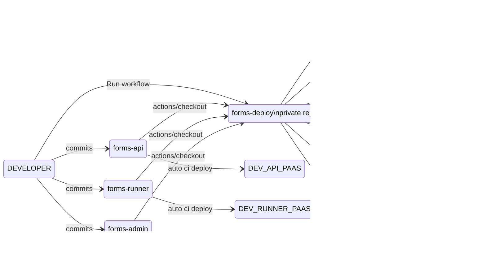

# forms-deploy
To deploy the applications that comprise GOV.UK Forms to the PaaS staging and production environments.

- [forms-admin](https://github.com/alphagov/forms-admin/)
- [forms-api](https://github.com/alphagov/forms-api/)
- [forms-runner](https://github.com/alphagov/forms-runner/)

**TODO** deploy to development too?

This is a *Private* repo due to some concerns raised by GDS IA, see [Assurance Report Use of Github Actions v1.0](https://docs.google.com/document/d/1f-0x5tamO7QjVGivsmFQ5RK9MKM84FRH/).

## How it works

Each application can be deployed to either the PaaS staging or production environment using [manually run workflows in GitHub Actions](https://github.com/alphagov/forms-deploy/actions).

Select the workflow you'd like to run from the list of workflows, e.g. "Deploy forms-admin to Staging", then choose "Run Workflow" > "Run Workflow".

Currently, the latest code in the main branch is deployed.

**TODO** allow / restrict to deploying from a specific SHA or tag.

## Secrets

Secrets (e.g. PaaS deployment account credentials, Notify API keys) are stored as [GitHub Secrets](https://github.com/alphagov/forms-deploy/settings/secrets/actions) in the relevant environment.

## Deployed Application URLs

### forms-admin

- https://admin.staging.forms.service.gov.uk/
- https://admin.forms.service.gov.uk/

### forms-api

- https://forms-api-staging.london.cloudapps.digital/
- https://forms-api-production.london.cloudapps.digital/

### forms-runner

- https://submit.staging.forms.service.gov.uk/
- https://submit.forms.service.gov.uk/
